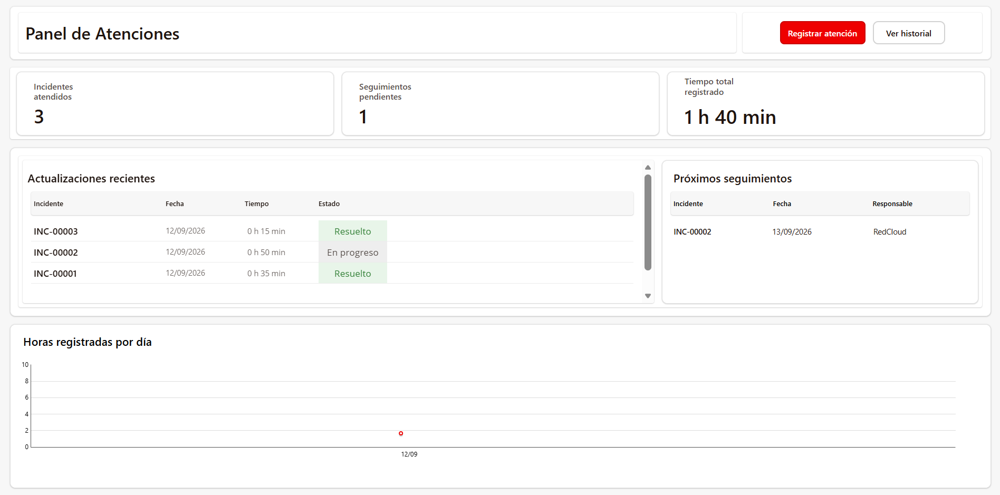
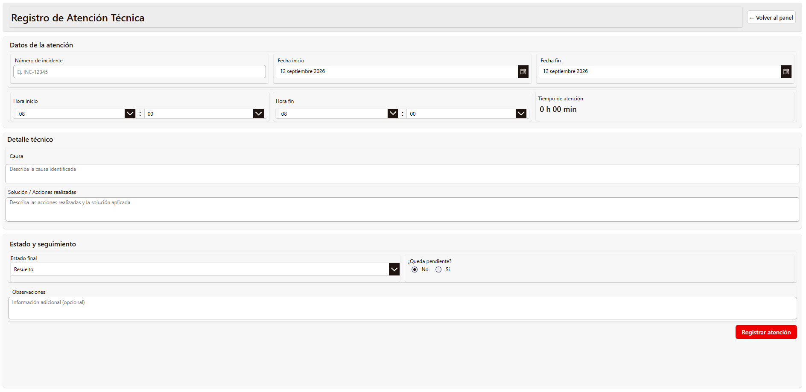
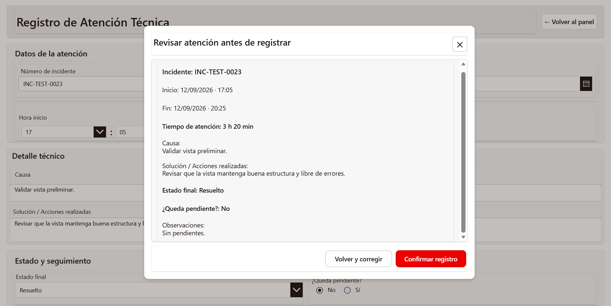
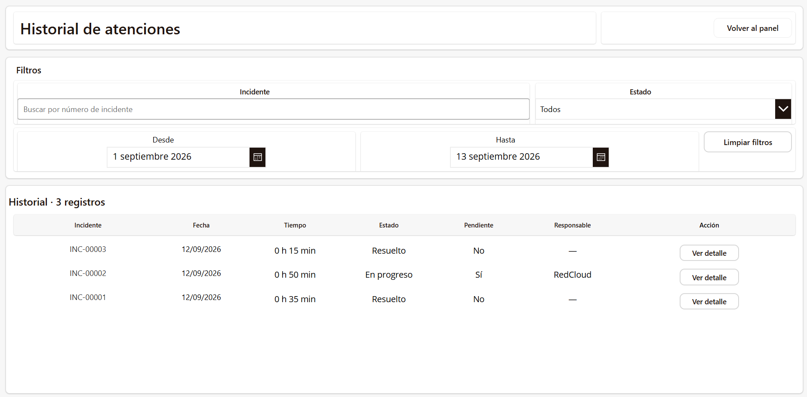
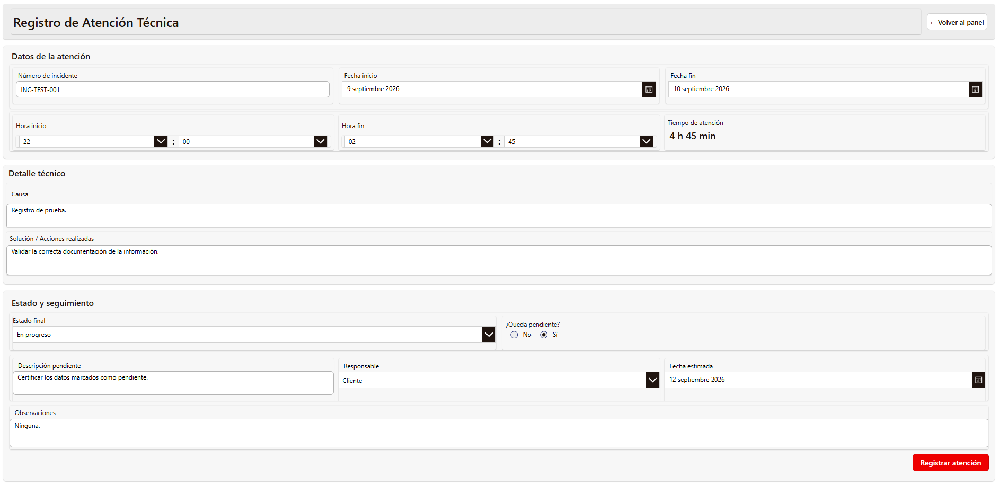
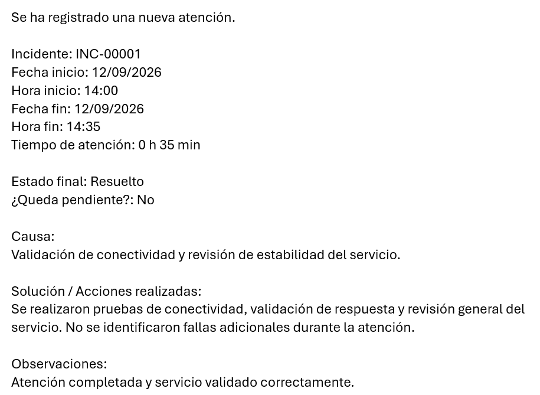

# Technical Attention Tracker

Power Apps solution for registering technical support activities, tracking pending follow-ups, and notifying the Remote Operations Center (ROC) through Power Automate.

## Overview

Technical Attention Tracker is an internal application built with Microsoft Power Apps to standardize the registration of technical support activities.

The solution records incident references, service times, actions performed, final status, and pending follow-ups. It also provides a dashboard and searchable history while automatically notifying the ROC when a new attention record is created.

## Key Features

- Register technical support activities linked to an incident number.
- Automatically calculate service duration from start and end date/time.
- Record cause, actions performed, final status, and observations.
- Manage pending follow-ups with responsible party and estimated date.
- Review information in a confirmation preview before saving.
- Display KPIs, recent updates, upcoming follow-ups, and registered hours in a dashboard.
- Search and filter historical records.
- Send automatic email notifications to the ROC through Power Automate.

## Architecture

The solution follows a simple Power Platform workflow:

**Power Apps → Microsoft Lists → Power Automate → ROC Email Notification**

- **Power Apps** provides the user interface for registering, reviewing, and consulting technical activities.
- **Microsoft Lists** stores the attention records and follow-up information.
- **Power Automate** sends automatic notifications to the ROC when a new record is created.

## Technologies

- Microsoft Power Apps
- Microsoft Lists
- Microsoft Power Automate
- Microsoft 365

## Screenshots

### Dashboard

The dashboard summarizes incident activity, pending follow-ups, total registered time, recent updates, upcoming follow-ups, and daily registered hours.

### Registration Form

The registration form captures incident details, service dates and times, technical cause, actions performed, final status, observations, and follow-up information when required.

### Registration Preview

Before saving, the user can review the complete attention record and either confirm the registration or return to correct the information.

### History

The history view allows users to search and filter registered technical activities by incident number, status, and date range.

### Conditional Follow-up Fields

When an attention requires additional follow-up, the form dynamically displays fields for pending details, responsible party, estimated date, and observations.

### ROC Email Notification

After a new attention record is created, Power Automate sends an automatic notification to the ROC with the main service details and the engineer account that registered the activity.

## Future Improvements

- Automatically retrieve ticket information from the ITSM platform using the incident number.
- Populate contextual information such as customer and opportunity data when available.
- Extend reporting capabilities if the solution is adopted for broader operational use.
